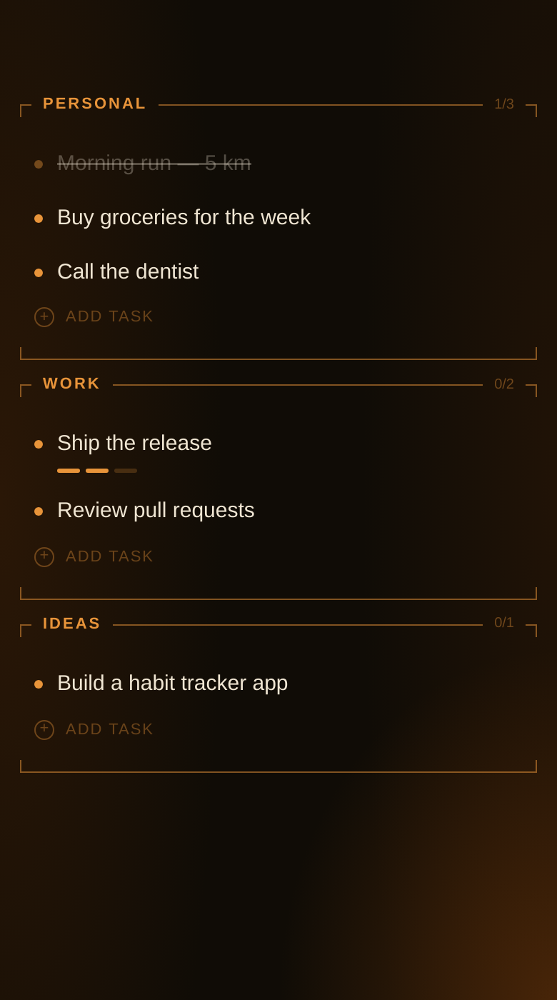
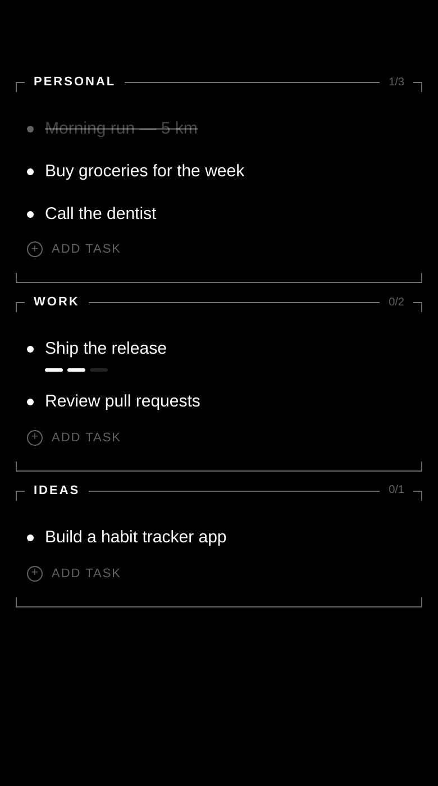
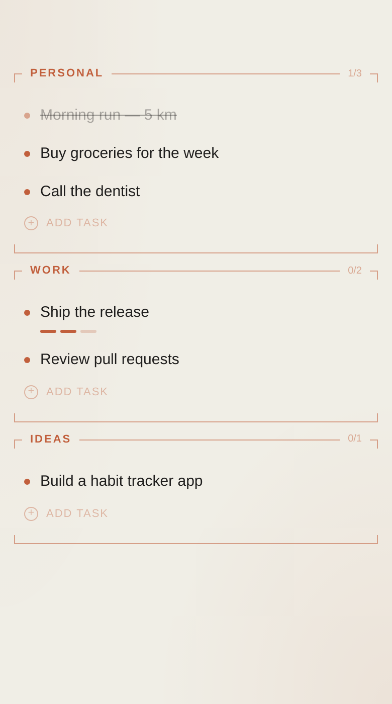
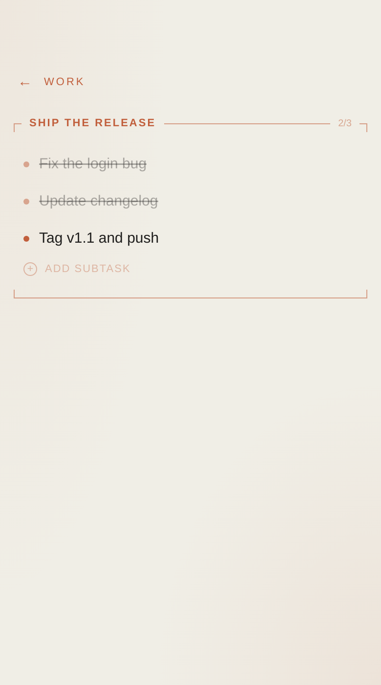

<p align="center">
  
</p>

<p align="center">
  Минималистичный todo-лист для Android, написанный на чистом JavaScript.<br/>
  Ни фреймворков, ни зависимостей, ни сборщика — только ванильный JS, CSS и немного любви к деталям.
</p>

<p align="center">
  <a href="https://github.com/FLEXIY0/todo/actions/workflows/build-apk.yml"></a>
  
  
  
</p>

---

## 🎬 Демо

<p align="center">
  
</p>

<p align="center"><sub>зачёркивание → подзадачи → листание пространств → история правок → смена темы</sub></p>

## ✨ Скриншоты

| Classic | OLED | Anthropic | Подзадачи |
|:---:|:---:|:---:|:---:|
|  |  |  |  |
| Янтарь на тёмном | Чистый чёрный | Айвори и терракота | Вложенный экран |

## 🌿 Возможности

- **Пространства** — листай влево/вправо между To-Do, Wishlist и общим пространством с плавной анимацией переворота книжной страницы, полностью подконтрольной пальцу. Пространства можно переименовывать, выключать, добавлять новые и прятать подписи вкладок (останется точка) — всё в настройках
- **Общее пространство** — две независимые синхронизируемые доски (To-Do и Wishlist) и два канала связи: напрямую телефон-телефон через WebRTC, плюс «почтовый ящик» — зашифрованный снапшот на публичном MQTT-брокере, так что телефоны **не обязаны быть онлайн одновременно**. Один тап «Invite» — код уже в буфере, на втором телефоне «Join» — и доски сливаются: объединение + побеждает последняя правка
- **История правок** — фиксируется *всё*: добавления, правки текста, выполнения, удаления, очистки, и даже отладочные события синхронизации. Любое удалённое возвращается одной кнопкой `↩`, правка текста откатывается. Глубина хранения настраивается прямо там (50 / 200 / 1000 / всё)
- **Дерево подзадач** — в вишлисте вложенность видна сразу: подзадачи раскрыты деревом с ветками `├ └`; в туду — минималистичные полоски. Переключается в настройках для каждого пространства
- **Экспорт в буфер** — задача, категория или всё пространство копируются как markdown-чеклист
- **Системный жест «назад»** — закрывает меню/экраны как отмена, а не сворачивает приложение
- **Категории и задачи** — редактируемый заголовок, счётчики `выполнено/всего`, плавная анимация зачёркивания, которую можно отменить на полпути
- **Подзадачи** — один уровень вложенности: под задачей появляются минималистичные полоски-индикаторы, тап открывает вложенный экран, а родительская задача завершается *сама*, когда закрыты все подзадачи
- **Перетаскивание категорий** — удержи заголовок категории и тащи: соседи плавно расступаются
- **Три темы** — `Classic` (янтарь на тёмно-коричневом), `OLED` (чистый чёрный для экономии экрана) и `Anthropic` (светлая, айвори с терракотой)
- **Всё на жестах** — ни одной лишней кнопки в интерфейсе
- **Автосохранение** — состояние живёт в `localStorage`, переживает перезапуск
- **Без аналитики и разрешений** — сеть используется только для синхронизации общего пространства, и только когда ты сам её включаешь

## 👆 Жесты

| Жест | Действие |
|---|---|
| Свайп влево / вправо | Перелистнуть на соседнее пространство (как страницу книги) |
| Тап по задаче | Выполнить / вернуть (анимация туда и обратно) |
| Тап по задаче с подзадачами | Открыть вложенный экран |
| Долгое нажатие на задачу | Меню: выполнить · подзадачи · изменить · удалить |
| Удержать заголовок категории и тащить | Поменять категории местами |
| Удержать заголовок категории и отпустить | Меню: переименовать · очистить выполненные · удалить |
| Долгое нажатие на пустое место | Добавить категорию / очистить всё выполненное |
| Свайп вправо от левого края | Открыть шторку с темами и настройками |
| Тап по заголовку приложения | Переименовать его во что угодно |

## 📦 Установка

Готовый APK лежит в [**Releases**](https://github.com/FLEXIY0/todo/releases) — скачай и установи.

APK универсальный: приложение — это Capacitor WebView без нативных библиотек, поэтому одна сборка работает на armv7, arm64 и x86.

## 🔨 Сборка

**Веб-версия** — сборки нет в принципе, просто открой `index.html`:

```bash
npx serve .
```

**APK локально:**

```bash
npm ci
npm run build            # копирует веб-файлы в www/
npx cap sync android     # синхронизирует их в Android-проект
cd android && ./gradlew assembleRelease
# → android/app/build/outputs/apk/release/app-release.apk
```

**APK через CI** — пушни тег, GitHub Actions соберёт и опубликует релиз сам:

```bash
git tag v1.1 && git push origin v1.1
```

## 🎨 Иконка

Иконка — пиксельный листик — не нарисована, а **сгенерирована кодом**: [`scripts/generate-icon.js`](scripts/generate-icon.js) содержит PNG-энкодер, написанный с нуля поверх `zlib` (никаких зависимостей), и рисует листик из сетки 16×16:

```
................
.......L........
......LLL.......
.....LLDLL......
....LHLDLLL.....
...LHLLDLLLL....
...LHLLDLLLL....
..LLLLLDLLLLL...
..LLLLLDLLLLL...
..LLLLLDLLLLL...
...LLLLDLLLL....
...LLLLDLLLL....
....LLLDLLL.....
.....LLDLL......
.......D........
......DD........
```

Один запуск `node scripts/generate-icon.js` пересоздаёт `icon.png` и все лаунчер-иконки Android (обычные, круглые и adaptive — для всех плотностей экрана). Хочешь другую иконку — поменяй буквы в сетке и перезапусти.

Анимированный баннер в шапке этого README (`docs/banner.svg`) собирается из **той же сетки** скриптом `scripts/generate-banner.js` — каждый квадратик появляется по очереди, потом листик тихонько покачивается.

## 🧠 Как устроено

```
index.html   — разметка, ни строчки логики
ui.js        — «хром»: шторка, bottom sheet, диалог, темы, жесты
app.js       — состояние, рендер, пространства, журнал, flip-движок
sync.js      — P2P-синхронизация общего пространства (WebRTC)
styles.css   — все стили и keyframe-анимации
vendor/      — единственная вендоренная библиотека: peerjs
android/     — Capacitor-проект для сборки APK
```

Пара решений, которыми я доволен:

- **Полный ре-рендер, кроме анимаций.** `render()` каждый раз пересобирает DOM целиком — просто и предсказуемо. Но во время анимации зачёркивания рендер *не* вызывается: классы переключаются точечно на живых элементах, поэтому анимацию нельзя «сбить», а повторный тап мгновенно разворачивает её в обратную сторону.
- **Два модальных примитива на всё.** Любое меню — это `openSheet()`, любой ввод — `openDialog()`. Больше модалок в приложении нет.
- **Завершение родителя — производное состояние.** Задачу с подзадачами нельзя отметить руками: её `done` всегда вычисляется из подзадач. Меньше способов получить противоречивое состояние.
